# IronCoreMD

`IronCoreMD` is intended to become a workflow repository for building iron datasets and machine-learning-ready archives for Earth-core and high-pressure iron studies.

The scientific target is a graph-kernel-based machine-learning interatomic potential for iron trained on first-principles data spanning:

- crystal structures: `bcc`, `fcc`, and `hcp`,
- simulation types: static relaxation and molecular dynamics,
- magnetic states: non-magnetic, noncollinear magnetic, and paramagnetic/disordered-spin configurations,
- extreme pressure-temperature conditions relevant to dense iron and core-like environments.

In practical terms, the repository is meant to document and eventually automate the workflow that starts from first-principles structure preparation and ends in training-ready datasets for a graph-kernel iron potential.

At the moment the repository is still in an early, script-first stage rather than a packaged Python library. The code currently included focuses on:

- parsing QE `.out` files from AIMD runs,
- extracting per-step structures, forces, energies, temperatures, pressures, and magnetization data,
- rendering No-Vito-style trajectory GIFs directly from compressed QE `.npz` archives,
- saving compact archives as `.npz` or `.pkl.xz`,
- and quickly inspecting the saved datasets.

## Project Scope

The planned role of this repository is to host the end-to-end workflow for generating, organizing, and preparing first-principles iron data for ML potential development.

That workflow is expected to cover:

- creation of `bcc`, `fcc`, and `hcp` supercells,
- preparation of QE inputs for non-magnetic, noncollinear, and paramagnetic states,
- structural relaxation runs at target pressures or volumes,
- finite-temperature MD sampling for each structural and magnetic state,
- compression and standardization of raw simulation outputs,
- and export of consistent training archives for a graph-kernel-based interatomic model.

The intended scientific workflow is therefore:

- choose a phase: `bcc`, `fcc`, or `hcp`,
- choose a magnetic description: non-magnetic, noncollinear, or paramagnetic,
- relax the structure at the target pressure, volume, or temperature condition,
- launch MD from the relaxed reference state,
- collect energies, forces, stresses, structures, and magnetic observables,
- and convert everything into a consistent dataset for ML potential fitting.

## Planned Workflow

The intended workflow for this repository is:

1. Build reference iron structures for `bcc`, `fcc`, and `hcp`.
2. Generate QE inputs for different magnetic states:
   - non-magnetic
   - noncollinear magnetic
   - paramagnetic or disordered local-moment style configurations
3. Run static relaxations to obtain pressure-consistent or volume-consistent reference structures.
4. Run ab initio MD from those relaxed structures across the desired pressure-temperature range.
5. Parse QE outputs and extract:
   - atomic positions
   - cell parameters
   - forces
   - energies
   - temperatures
   - pressures
   - magnetic observables when available
6. Save compressed archives in a uniform format for downstream model building.
7. Assemble training, validation, and testing datasets for a graph-kernel-based ML interatomic potential.

This means the repository is meant to grow beyond simple compression scripts into a reproducible data-generation workflow for magnetic and non-magnetic iron phases, with explicit support for relax-plus-MD campaigns across `bcc`, `fcc`, and `hcp` Fe.

## Current Layout

```text
IronCoreMD/
├── LICENSE
├── README.md
└── codes/
    ├── data_compress.py
    ├── live_qe_check.sh
    ├── qe_npz_to_gif.py
    ├── load_data.py
    └── generate_structures.ipynb

```

## Current Repository State

Right now, the repository contains early utilities for output inspection and archive generation. The relaxation, MD setup, magnetic-state generation, and ML-potential training stages described above are part of the intended workflow, but they are not yet fully implemented in this repository.

## Current Results

The figures below summarize the current non-magnetic `bcc` and `hcp` Fe datasets generated from QE AIMD and TDEP postprocessing.

`Reference pressure-temperature window` used to contextualize the present iron simulations:

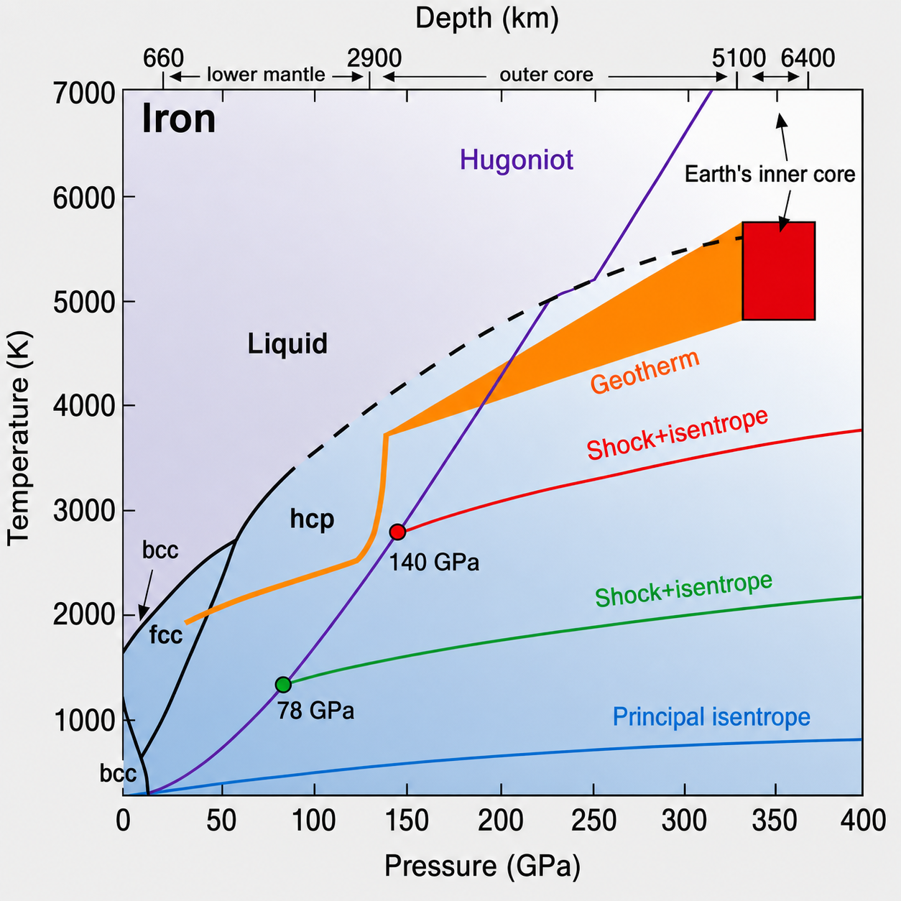

### BCC Fe

The `bcc` dataset currently includes finite-temperature thermodynamic comparisons between `4500 K` and `5000 K`, plus phonon and trajectory visualization products.

`Free Helmholtz energy vs volume`, with separate Birch-Murnaghan fits for `4500 K` and `5000 K`:

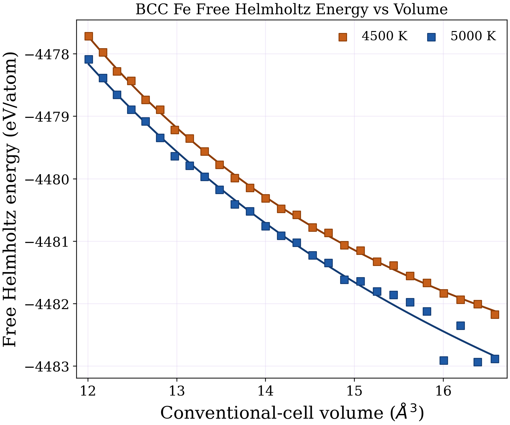

`Pressure vs volume`, using separate Birch-Murnaghan fits to the AIMD mean pressures for `4500 K` and `5000 K`:

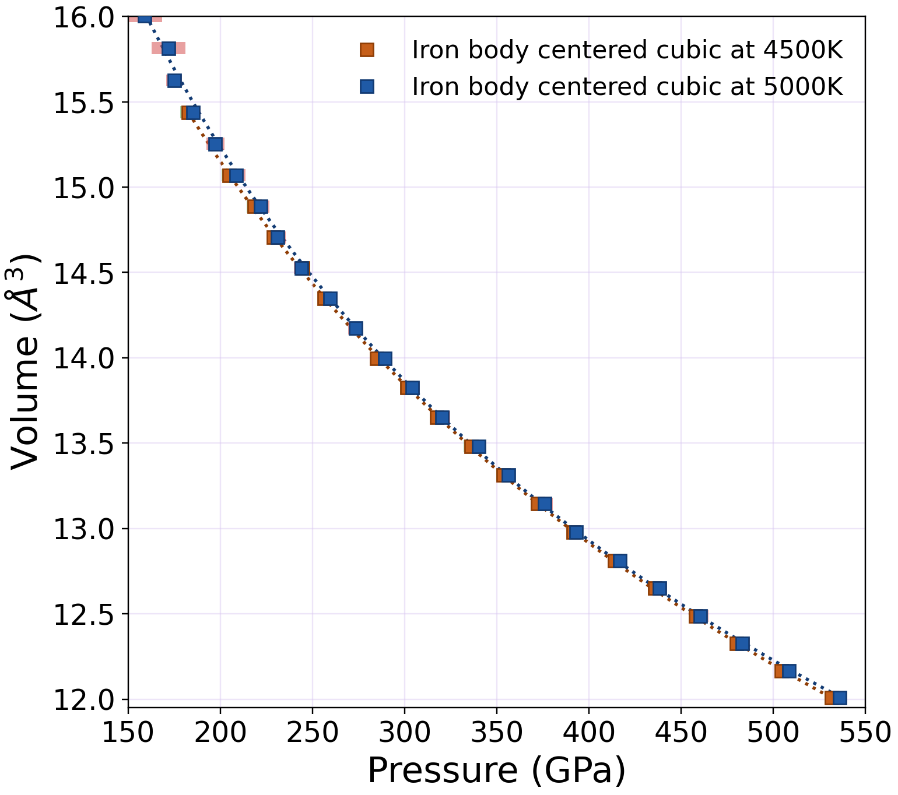

`Phonon dispersion and total DOS overlays` for the current `bcc` volume sets at `4500 K` and `5000 K`:

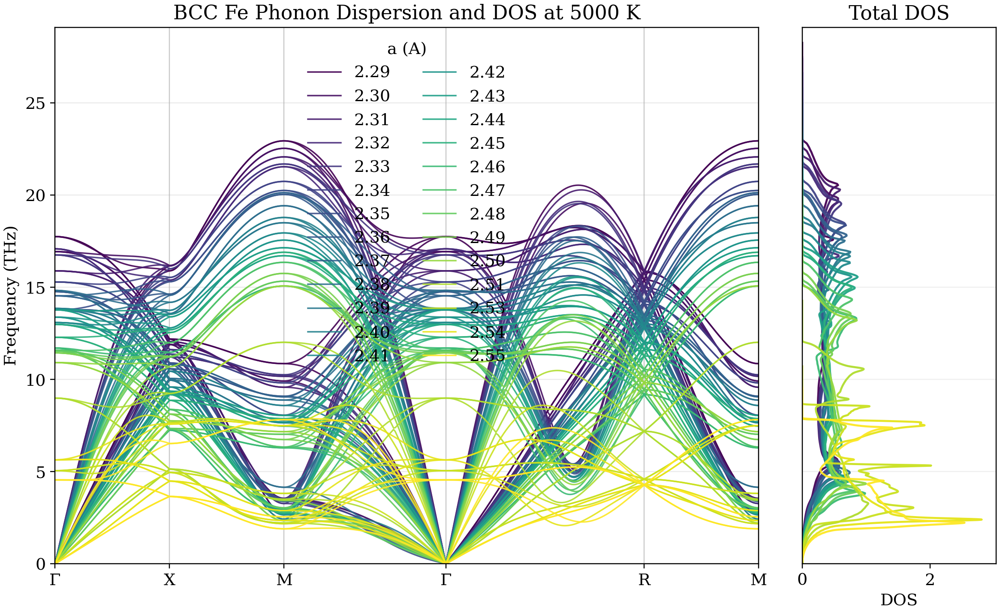

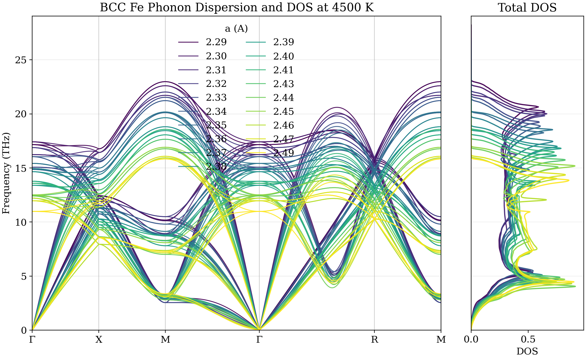

`QE MD trajectory GIF` from the `bcc a = 2.40 Å, 5000 K` run:

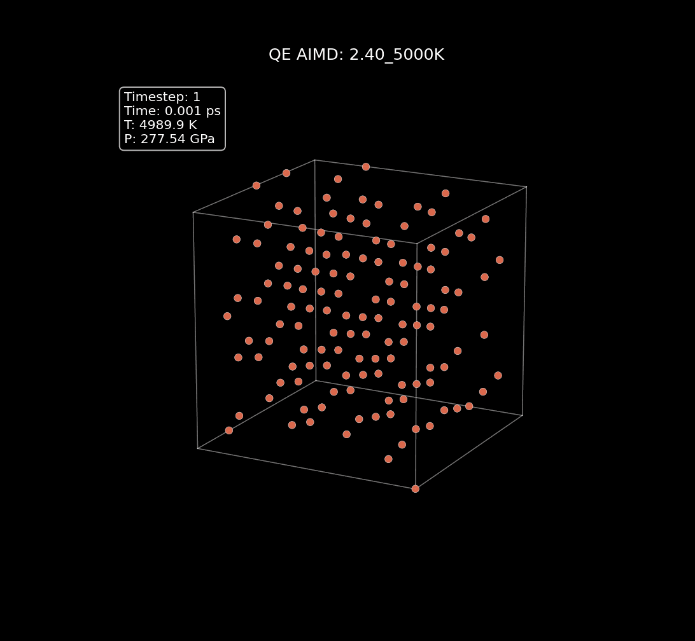

### HCP Fe

The `hcp` dataset currently includes `5000 K` Helmholtz free-energy and pressure-volume results together with the phonon dispersion comparison across the sampled volumes.

`Free Helmholtz energy vs volume` at `5000 K`:

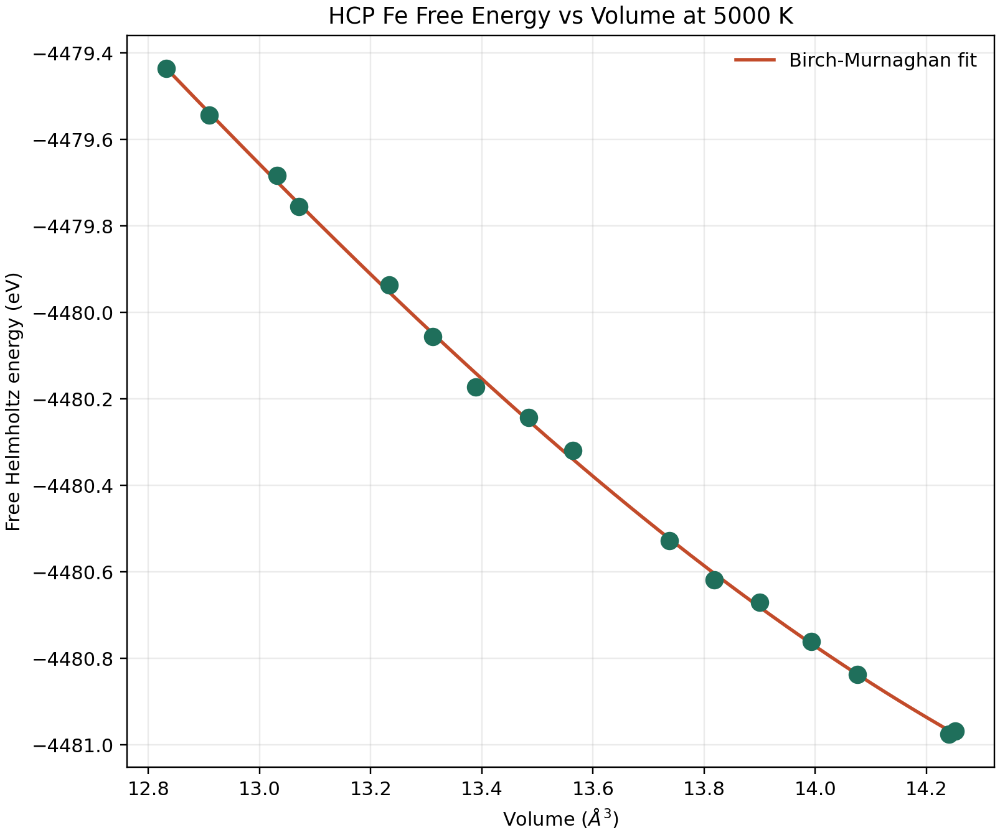

`Pressure vs volume` at `5000 K`, using the same EOS-style presentation as the `bcc` plot:

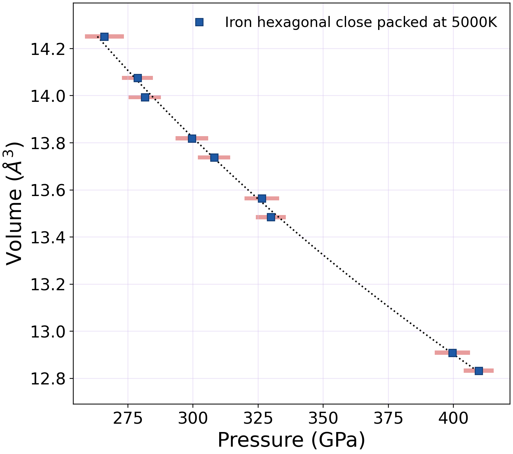

`Phonon dispersion overlay` for the current `hcp` volume set:

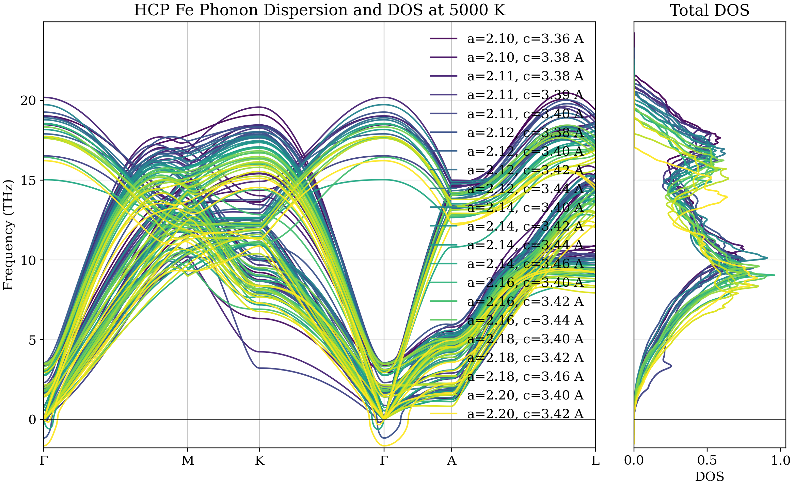

One `hcp` configuration, `tdep_a_2.20_c_3.42_5000K`, remains dynamically unstable. It is kept in the phonon-dispersion comparison for reference, but it is excluded from the `hcp` free-energy and pressure-volume thermodynamic plots.

### FCC Fe

The `fcc` dataset currently contains an initial `5000 K` two-point free-energy summary together with phonon calculations for `a = 3.00 Å` and `a = 3.05 Å`.

`Free Helmholtz energy vs volume` at `5000 K` for the currently available `fcc` points:

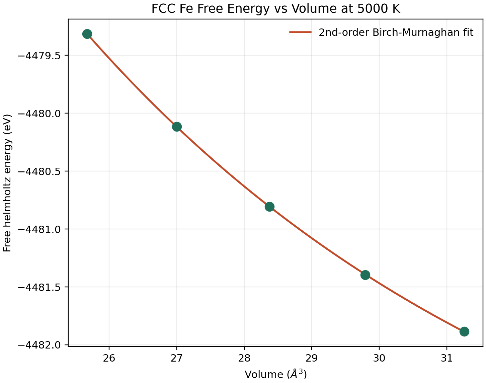

`Phonon dispersion and total DOS` for the current `fcc` set:

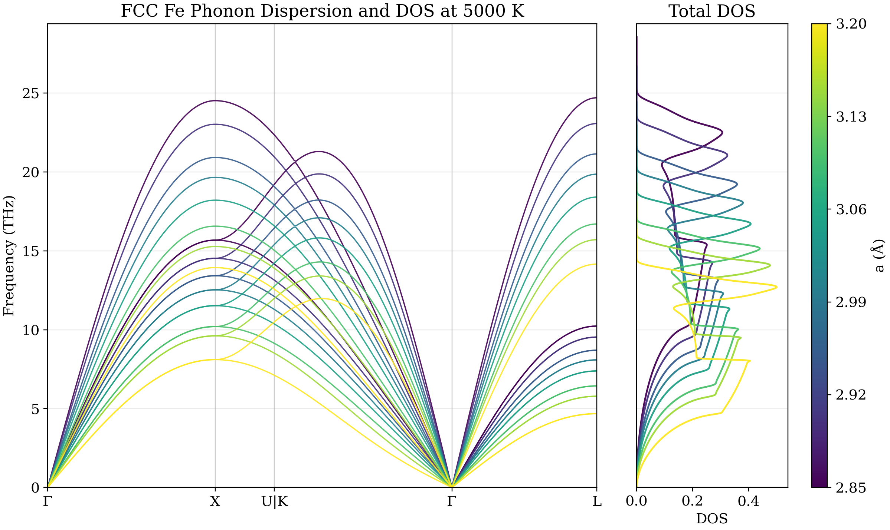

## What The Current Scripts Do

### `codes/data_compress.py`

Main parser and archive writer.

It recursively scans a root directory for QE output files, chooses one output per simulation folder, parses the MD trajectory, and writes compressed archives plus a manifest.

The parser currently extracts:

- number of atoms,
- lattice parameter `alat`,
- initial cell and positions from the QE header,
- per-step `CELL_PARAMETERS`,
- per-step `ATOMIC_POSITIONS`,
- per-step forces,
- total energy,
- internal energy,
- kinetic energy,
- temperature,
- pressure in kbar and GPa,
- total and absolute magnetization.

Supported output formats:

- `npz`
- `pkl.xz`

It also writes `manifest.json` summarizing successful and failed parses.

### `codes/load_data.py`

Minimal inspection helper for a saved `.npz` archive.

It loads one archive, prints the stored keys, and shows the shapes/units of the main arrays. This is useful for a quick sanity check after compression.

### `codes/live_qe_check.sh`

Lightweight live monitor for a running QE calculation.

It repeatedly parses a QE `.out` file and uses `gnuplot` to update a dashboard image in real time. This is useful while running relaxations or MD because it gives a quick live view of:

- SCF convergence,
- total energy per atom,
- total magnetization components,
- absolute magnetization,
- pressure,
- total force,
- and temperature.

The script writes intermediate `.dat` files plus a `qe_live_dashboard.png` image that refreshes every few seconds.

### `codes/qe_npz_to_gif.py`

Standalone renderer for creating animated GIFs directly from QE MD archives saved as `.npz`.

It follows the same lightweight visual idea used in the `No-Vito` project, but it reads the QE parser output from this repository instead of LAMMPS dumps. For each frame it:

- reads atomic positions from the compressed archive,
- reconstructs Cartesian coordinates from QE units,
- draws the simulation cell,
- renders the atoms in a dark 3D scene,
- and overlays a boxed legend with timestep, time, temperature, and pressure.

This is useful for quickly inspecting MD trajectories without opening OVITO or writing a separate conversion pipeline.

## Requirements

The current scripts need a small Python stack plus standard shell tools:

- Python 3.9+
- `numpy`
- `matplotlib`
- `Pillow`
- `bash`
- `awk`
- `gnuplot`

Standard-library modules used:

- `json`
- `os`
- `re`
- `pickle`
- `lzma`
- `pathlib`

## Quick Start

### 1. Edit the user settings

Open `codes/data_compress.py` and adjust the constants near the top:

```python
ROOT_DIR = "/path/to/qe/runs"
OUTPUT_DIR = "/path/to/output_archives"
SAVE_FMT = "npz"           # or "pkl_xz"
OUT_FILE_EXTENSIONS = (".out",)
CHOOSE_IF_MULTIPLE = "largest"   # or "newest"
SKIP_EMPTY = True
```

Important: the script is currently configured with hardcoded local paths, so you should change these before running it on a different machine or dataset.

### 2. Run the compression script

From the repository root:

```bash
python3 codes/data_compress.py
```

This will:

- walk `ROOT_DIR`,
- find simulation folders containing `.out` files,
- choose one output file per folder,
- parse the AIMD data,
- write compressed archives to `OUTPUT_DIR`,
- write `manifest.json` to `OUTPUT_DIR`.

### 3. Inspect one saved archive

Edit the path in `codes/load_data.py`, then run:

```bash
python3 codes/load_data.py
```

### 4. Monitor a running QE job live

From the repository root:

```bash
bash codes/live_qe_check.sh /path/to/qe_output.out
```

Optional refresh interval in seconds:

```bash
bash codes/live_qe_check.sh /path/to/qe_output.out 5
```

This updates `qe_live_dashboard.png` continuously while the QE output file grows.

### 5. Render a GIF from a QE `.npz` archive

From the repository root:

```bash
python3 codes/qe_npz_to_gif.py /path/to/trajectory.npz
```

Example with lighter sampling and slower playback:

```bash
python3 codes/qe_npz_to_gif.py /path/to/trajectory.npz --every 5 --fps 5
```

Optional controls include:

- `--start` and `--stop` to select a frame range,
- `--every` to subsample frames,
- `--fps` to control animation speed,
- and `--output` to choose the GIF filename.

## Output Archive Contents

The saved archives are designed to preserve the QE trajectory as printed, with minimal postprocessing.

Typical keys include:

- `source_file`
- `input_file`
- `natoms`
- `nsteps`
- `species`
- `initial_positions_alat`
- `initial_cell_alat`
- `positions`
- `positions_unit`
- `cell_parameters`
- `cell_parameters_unit`
- `forces_ry_au`
- `energy_ry`
- `internal_energy_ry`
- `ekin_ry`
- `temperature_K`
- `pressure_kbar`
- `pressure_GPa`
- `mag_total_Bohr`
- `abs_mag_total_Bohr`

For `.npz` archives, scalar metadata are stored in `metadata_json`.

## Input Assumptions

The current parser assumes QE output that contains:

- a standard header with `number of atoms/cell` and `lattice parameter (alat)`,
- `crystal axes`,
- `Cartesian axes` with `tau(...)`,
- MD blocks introduced by `Entering Dynamics: iteration = ...`,
- optional `CELL_PARAMETERS`,
- `ATOMIC_POSITIONS`,
- `Forces acting on atoms`.

If a matching QE input file with the same stem exists beside the output file, the script also tries to read the original `CELL_PARAMETERS` block from that `.in` file.

## Current Limitations

- No command-line interface yet; configuration is done by editing constants in the script.
- No automated tests yet.
- The parser is tuned for the QE formats currently used in this project and may need adjustment for other output styles.
- `load_data.py` also uses a hardcoded archive path and is only a lightweight inspection script.
- `live_qe_check.sh` currently assumes QE text patterns similar to the outputs used in this project and writes its `.dat` files and PNG to the current working directory.
- `qe_npz_to_gif.py` assumes the `.npz` archive follows the schema produced by `data_compress.py`.

## Suggested Next Steps

Natural extensions for this repository would be:

- adding structure-generation helpers for `bcc`, `fcc`, and `hcp` iron,
- adding QE input templates for non-magnetic, noncollinear, and paramagnetic runs,
- adding relaxation and MD job-generation workflows,
- adding a CLI with `argparse`,
- removing hardcoded paths,
- adding unit tests for representative QE outputs,
- documenting the archive schema more formally,
- supporting additional engines or archive backends,
- and adding dataset assembly tools for graph-kernel-based ML interatomic potential training.

## References

The Temperature Dependent Effective Potential (TDEP) method was used in this work to extract finite-temperature interatomic force constants and evaluate anharmonic lattice dynamics. The theoretical and computational framework follows the original TDEP formalism and its modern software implementation:

1. Hellman, O., Steneteg, P., Abrikosov, I. A., & Simak, S. I.  
   **Temperature dependent effective potential method for accurate free energy calculations of solids**.  
   *Physical Review B* **87**, 104111 (2013).  
   https://doi.org/10.1103/PhysRevB.87.104111

2. Hellman, O., & Abrikosov, I. A.  
   **Temperature-dependent effective third-order interatomic force constants from first principles**.  
   *Physical Review B* **88**, 144301 (2013).  
   https://doi.org/10.1103/PhysRevB.88.144301

3. Knoop, F., Shulumba, N., Castellano, A., Batista, J. P. A., Farris, R., Verdi, C., Fransson, E., Abrikosov, I. A., Simak, S. I., & Hellman, O.  
   **TDEP: Temperature Dependent Effective Potentials**.  
   *Journal of Open Source Software* **9**, 6150 (2024).  
   https://doi.org/10.21105/joss.06150

## License

This project is distributed under the terms in [LICENSE](LICENSE).
