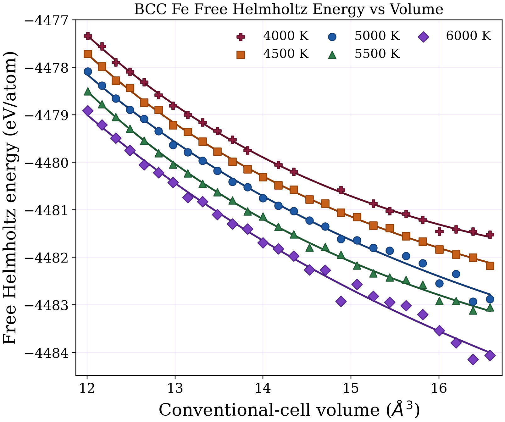
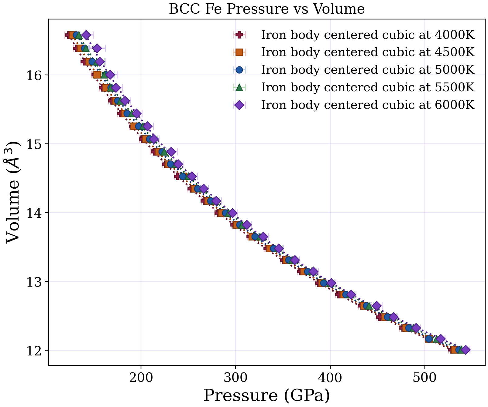
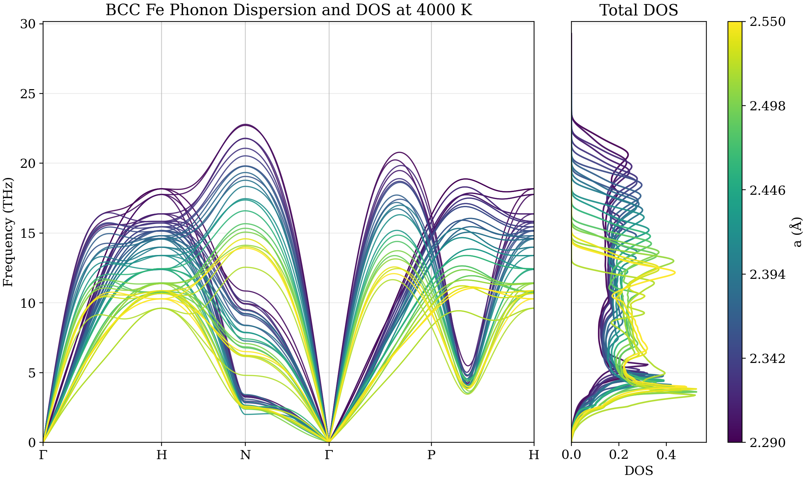
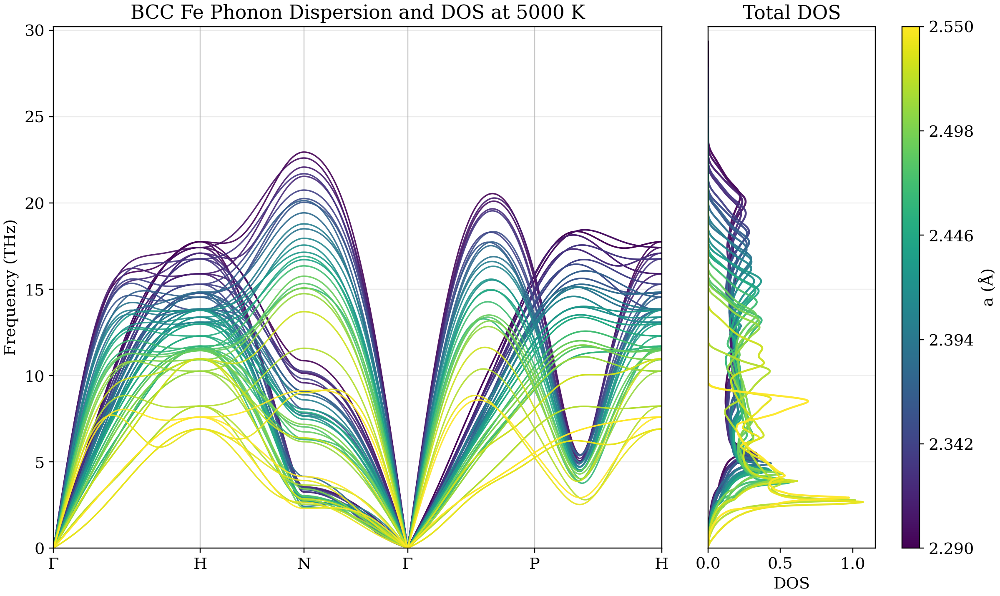
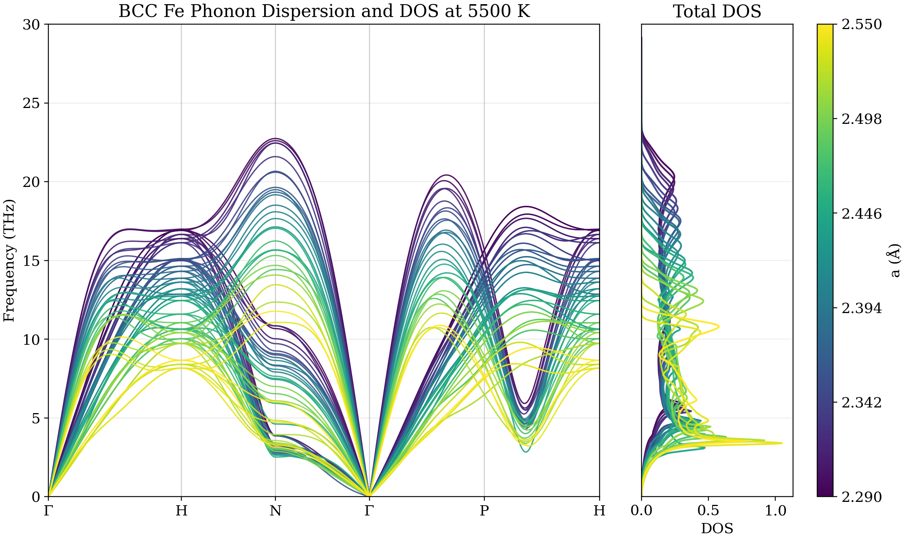
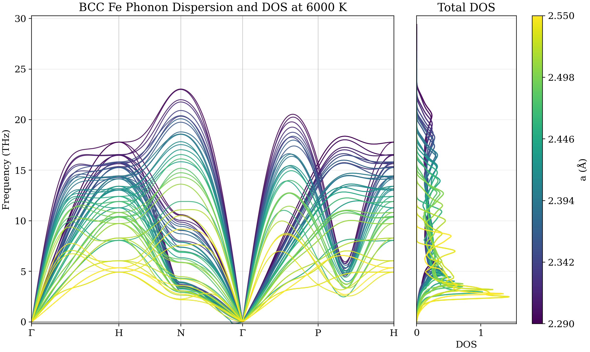
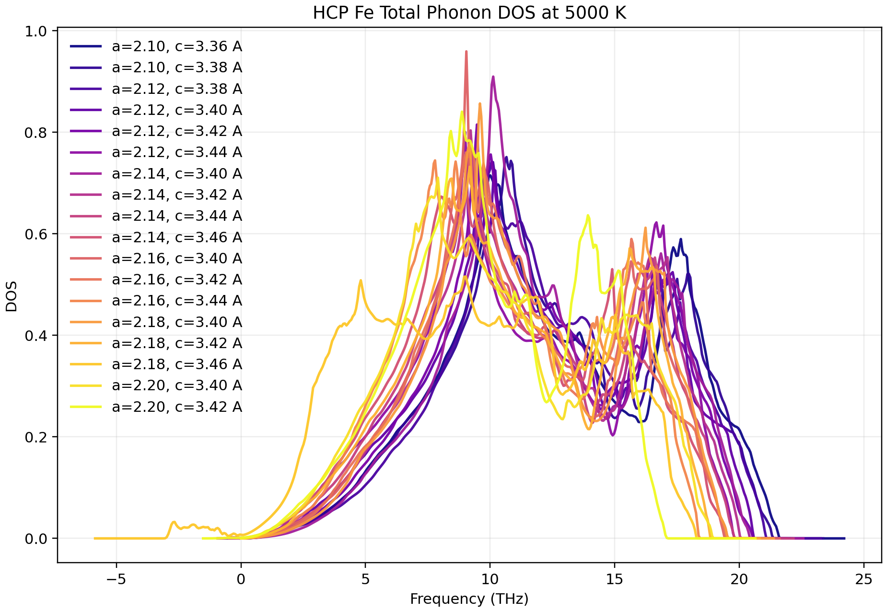
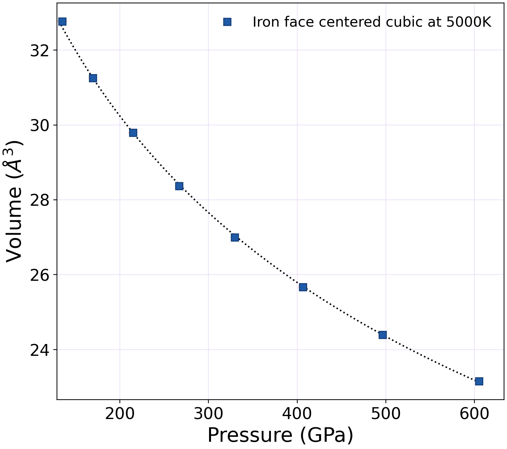
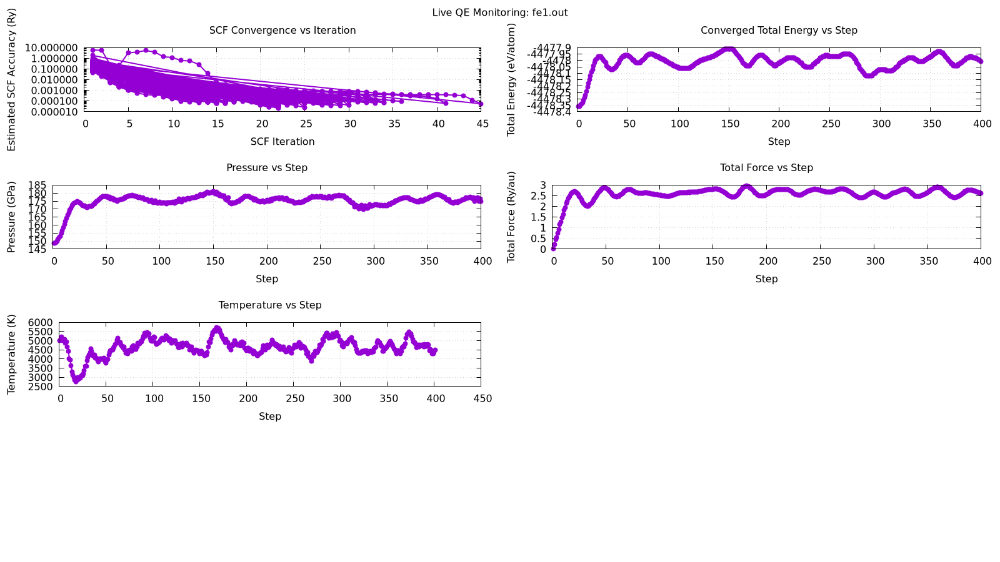

# IronCoreMD
`IronCoreMD` is intended to become a workflow repository for building iron datasets and machine-learning-ready archives for Earth-core and high-pressure iron studies.

The scientific target is a graph-kernel-based machine-learning interatomic potential for iron trained on first-principles data spanning:

- crystal structures: `bcc`, `fcc`, and `hcp`,
- simulation types: static relaxation and molecular dynamics,
- magnetic states: non-magnetic, noncollinear magnetic, and paramagnetic/disordered-spin configurations,
- extreme pressure-temperature conditions relevant to dense iron and core-like environments.

In practical terms, the repository is meant to document and eventually automate the workflow that starts from first-principles structure preparation and ends in training-ready datasets for a graph-kernel iron potential.

At the moment the repository is still in an early, script-first stage rather than a packaged Python library. The code currently included focuses on:


- parsing QE `.out` files from AIMD runs,
- extracting per-step structures, forces, energies, temperatures, pressures, and magnetization data,
- rendering No-Vito-style trajectory GIFs directly from compressed QE `.npz` archives,
- saving compact archives as `.npz` or `.pkl.xz`,
- and quickly inspecting the saved datasets.

## Project Scope

The planned role of this repository is to host the end-to-end workflow for generating, organizing, and preparing first-principles iron data for ML potential development.

That workflow is expected to cover:

- creation of `bcc`, `fcc`, and `hcp` supercells,
- preparation of QE inputs for non-magnetic, noncollinear, and paramagnetic states,
- structural relaxation runs at target pressures or volumes,
- finite-temperature MD sampling for each structural and magnetic state,
- compression and standardization of raw simulation outputs,
- and export of consistent training archives for a graph-kernel-based interatomic model.

The intended scientific workflow is therefore:

- choose a phase: `bcc`, `fcc`, or `hcp`,
- choose a magnetic description: non-magnetic, noncollinear, or paramagnetic,
- relax the structure at the target pressure, volume, or temperature condition,
- launch MD from the relaxed reference state,
- collect energies, forces, stresses, structures, and magnetic observables,
- and convert everything into a consistent dataset for ML potential fitting.

## Planned Workflow

The intended workflow for this repository is:


1. Build reference iron structures for `bcc`, `fcc`, and `hcp`.
2. Generate QE inputs for different magnetic states:
   - non-magnetic
   - noncollinear magnetic
   - paramagnetic or disordered local-moment style configurations
3. Run static relaxations to obtain pressure-consistent or volume-consistent reference structures.
4. Run ab initio MD from those relaxed structures across the desired pressure-temperature range.
5. Parse QE outputs and extract:
   - atomic positions
   - cell parameters
   - forces
   - energies
   - temperatures
   - pressures
   - magnetic observables when available
6. Save compressed archives in a uniform format for downstream model building.
7. Assemble training, validation, and testing datasets for a graph-kernel-based ML interatomic potential.

This means the repository is meant to grow beyond simple compression scripts into a reproducible data-generation workflow for magnetic and non-magnetic iron phases, with explicit support for relax-plus-MD campaigns across `bcc`, `fcc`, and `hcp` Fe.

## Current Layout

```text
IronCoreMD/
├── LICENSE
├── README.md
├── assets/
│   ├── phase-diag-range-geot.png
│   ├── bcc_2.40_5000K_qe_md_slow.gif
│   ├── bcc_free_energy_vs_volume_4000K_4500K_5000K_5500K_6000K.png
│   ├── bcc_volume_vs_pressure_4000K_4500K_5000K_5500K_6000K.png
│   ├── bcc_phonon_dispersion_overlay_4000K.png
│   ├── bcc_phonon_dispersion_overlay_4500K.png
│   ├── bcc_phonon_dispersion_overlay_5000K.png
│   ├── bcc_phonon_dispersion_overlay_5500K.png
│   ├── bcc_phonon_dispersion_overlay_6000K.png
│   ├── hcp_free_energy_vs_volume.png
│   ├── hcp_volume_vs_pressure_5000K_eos_std.png
│   ├── hcp_phonon_dispersion_overlay.png
│   ├── hcp_phonon_dos_overlay.png
│   ├── fcc_free_energy_vs_volume.png
│   ├── fcc_volume_vs_pressure_5000K_eos_std.png
│   ├── fcc_phonon_dispersion_overlay.png
│   ├── qe_live_dashboard.png
│   └── ...
└── codes/
    ├── data_compress.py
    ├── generate_stochastic_bcc_configs.py
    ├── build_bcc_qe_md_inputs.py
    ├── live_qe_check.sh
    ├── load_data.py
    ├── ml_cpu_regression.py
    ├── ml_gpr.py
    ├── ml_gpr_dataset_workflow.ipynb
    ├── npz_to_extxyz.py
    ├── plot_ml_dataset_split.py
    ├── plot_bcc_hcp_volume_vs_pressure.py
    ├── qe_npz_to_gif.py
    └── tdep_workflow/
        ├── README.md
        ├── npz_to_tdep_bcc.py
        ├── npz_to_tdep_fcc.py
        ├── npz_to_tdep_hcp.py
        ├── run_bcc_harmonic_tdep.py
        ├── run_fcc_harmonic_tdep.py
        ├── run_hcp_harmonic_tdep.py
        ├── summarize_free_energy.py
        ├── plot_free_energy_vs_volume.py
        ├── plot_volume_vs_pressure.py
        ├── plot_combined_dispersion.py
        ├── plot_temperature_comparison.py
        └── tdep_common.py

```

## Current Repository State

Right now, the repository contains early utilities for output inspection and archive generation together with a reusable phase-aware non-magnetic TDEP postprocessing workflow under `codes/tdep_workflow/` for `bcc`, `fcc`, and `hcp` datasets. The broader relaxation, MD setup, magnetic-state generation, and ML-potential training stages described above are still evolving and are not yet fully implemented as a single end-to-end packaged workflow.

## Current Results

The figures below summarize the current `bcc`, `hcp`, and `fcc` Fe datasets generated from QE AIMD and TDEP postprocessing.

`Reference pressure-temperature window` used to contextualize the present iron simulations:

<p align="center">
  
</p>

### BCC Fe

The `bcc` dataset currently includes finite-temperature thermodynamic comparisons between `4000 K`, `4500 K`, `5000 K`, `5500 K`, and `6000 K`, plus phonon and trajectory visualization products.

`Free Helmholtz energy vs volume` and `pressure vs volume`, with separate Birch-Murnaghan fits for `4000 K`, `4500 K`, `5000 K`, `5500 K`, and `6000 K`:

<p align="center">
  
  
</p>

`Phonon dispersion and total DOS overlays` for the current `bcc` volume sets at `4000 K`, `4500 K`, `5000 K`, `5500 K`, and `6000 K`:

<p align="center">
  
  
  
  
  
</p>

`QE MD trajectory GIF` from the `bcc a = 2.40 Å, 5000 K` run:

<p align="center">
  
</p>

### HCP Fe

The `hcp` dataset currently includes a `5000 K` thermodynamic summary across the present volume scan together with updated phonon-dispersion and DOS overlays.

`Free Helmholtz energy vs volume` and `pressure vs volume` at `5000 K`, using the same EOS-style presentation as the `bcc` plot:

<p align="center">
  
  
</p>

`Phonon dispersion and total DOS overlay` for the current `hcp` volume set:

<p align="center">
  
</p>

`Standalone total DOS overlay` for the same `hcp` set:

<p align="center">
  
</p>

The current `hcp` thermodynamic summary uses `13` accepted points. Four configurations are dynamically unstable on the sampled path, `tdep_a_2.12_c_3.38_5000K`, `tdep_a_2.14_c_3.46_5000K`, `tdep_a_2.18_c_3.46_5000K`, and `tdep_a_2.20_c_3.42_5000K`. One additional case, `tdep_a_2.14_c_3.44_5000K`, is excluded because the Brillouin-zone free-energy step returned an unphysical value. These rejected cases are still visible in the phonon overlays for reference.

### FCC Fe

The `fcc` dataset now includes an `8`-point `5000 K` thermodynamic summary spanning `a = 2.85-3.20 Å`, together with updated pressure-volume and phonon results for the same set.

`Free Helmholtz energy vs volume` and `pressure vs volume` at `5000 K`:

<p align="center">
  
  
</p>

`Phonon dispersion and total DOS overlay` for the current `fcc` volume set:

<p align="center">
  
</p>

All eight current `fcc` runs are included in the present thermodynamic and phonon summaries.

## What The Current Scripts Do

### `codes/data_compress.py`

Main parser and archive writer.

It recursively scans a root directory for QE output files, chooses one output per simulation folder, parses the MD trajectory, and writes compressed archives plus a manifest.

The parser currently extracts:

- number of atoms,
- lattice parameter `alat`,
- initial cell and positions from the QE header,
- per-step `CELL_PARAMETERS`,
- per-step `ATOMIC_POSITIONS`,
- per-step forces,
- total energy,
- internal energy,
- kinetic energy,
- temperature,
- pressure in kbar and GPa,
- total and absolute magnetization.

Supported output formats:

- `npz`
- `pkl.xz`

It also writes `manifest.json` summarizing successful and failed parses.

### `codes/load_data.py`

Minimal inspection helper for a saved `.npz` archive.

It loads one archive, prints the stored keys, and shows the shapes/units of the main arrays. This is useful for a quick sanity check after compression.

### `codes/live_qe_check.sh`

Lightweight live monitor for a running QE calculation.

It repeatedly parses a QE `.out` file and uses `gnuplot` to update a dashboard image in real time. This is useful while running relaxations or MD because it gives a quick live view of:

- SCF convergence,
- total energy per atom,
- total magnetization components,
- absolute magnetization,
- pressure,
- total force,
- and temperature.

The script writes intermediate `.dat` files plus a `qe_live_dashboard.png` image that refreshes every few seconds.

Example dashboard output from `codes/live_qe_check.sh`:

<p align="center">
  
</p>

### `codes/qe_npz_to_gif.py`

Standalone renderer for creating animated GIFs directly from QE MD archives saved as `.npz`.

It follows the same lightweight visual idea used in the `No-Vito` project, but it reads the QE parser output from this repository instead of LAMMPS dumps. For each frame it:

- reads atomic positions from the compressed archive,
- reconstructs Cartesian coordinates from QE units,
- draws the simulation cell,
- renders the atoms in a dark 3D scene,
- and overlays a boxed legend with timestep, time, temperature, and pressure.

This is useful for quickly inspecting MD trajectories without opening OVITO or writing a separate conversion pipeline.

### `codes/ml_gpr.py`

GraphDot-based Gaussian-process-regression helper for building an ML-ready dataset from the repository NPZ archives and then fitting the model.

The dataset-loading part of this script now supports:

- direct selection of the repository `bcc`, `fcc`, and `hcp` NPZ datasets,
- explicit file or glob selection when you want to train on only part of the archive set,
- mixed datasets built from any combination of `bcc`, `fcc`, and `hcp`,
- and backward compatibility with the older QE text-output reader.

For NPZ inputs, the script reconstructs `ase.Atoms` frame by frame from:

- `symbols`,
- `positions`,
- `positions_unit`,
- `input_cell_parameters`,
- optional per-frame `cell_parameters`,
- and `energy_ry`.

The GPR model section was left unchanged in spirit, but the dataset-entry stage now adds a pre-model preview workflow so you can inspect what will go into training and testing before the fit starts.

Current command-line controls include:

- `--phase bcc fcc hcp` to choose phase groups from the repository dataset tree,
- `--inputs` to pass explicit NPZ paths or glob patterns,
- `--run-name` to label the current dataset/model run without hardcoding a fixed name,
- `--output-root` to choose where preview files, models, and plots are written,
- `--seed` to control the train/test split,
- and `--preview-only` to stop after writing the dataset preview and split files.

`Preview-only` mode is useful when you want to verify the dataset before spending time on the GPR fit.

Example: preview the default mixed `bcc` + `fcc` + `hcp` NPZ selection:

```bash
python3 codes/ml_gpr.py --preview-only
```

Example: preview only `bcc` and `fcc`:

```bash
python3 codes/ml_gpr.py --phase bcc fcc --run-name bcc_fcc_preview --preview-only
```

Example: use explicit files or glob patterns:

```bash
python3 codes/ml_gpr.py \
  --inputs \
  "dataset/bcc/non-mag/2.29_5000K.npz" \
  "dataset/fcc/non-mag/3.0*_5000K.npz" \
  "dataset/hcp/a_2.16_c_*.npz" \
  --run-name mixed_selected_set \
  --preview-only
```

Before training, the script writes:

- `<run_name>_dataset_preview.csv`: full dataset table for all accepted frames,
- `<run_name>_train_split.csv`: the subset selected for training,
- `<run_name>_test_split.csv`: the subset selected for testing,
- `<run_name>_dataset_preview.png`: a pre-model figure showing energy distribution, train/test assignment, and frames per source file.

When the fit is actually run, it also writes:

- `<run_name>_gpr_DFT_EperAtom_<Ntrain>.pkl`: saved GraphDot GPR model,
- `<run_name>_parity_plot.png`: parity plot comparing predicted and ground-truth energy per atom.

### `codes/ml_cpu_regression.py`

CPU-only regression baseline for the same NPZ/QE dataset-selection workflow, designed for systems where `graphdot` and CUDA are not available.

This script reuses the same dataset-selection pattern as `ml_gpr.py`, but replaces the CUDA-dependent graph kernel with lightweight structural descriptors and a scikit-learn ensemble regressor. The descriptor includes:

- cell metrics (`a`, `b`, `c`, `alpha`, `beta`, `gamma`),
- volume per atom and density,
- averaged nearest-neighbor shell distances,
- and one-hot phase labels for `bcc`, `fcc`, `hcp`, or `mixed`.

Current model options are:

- `random_forest`
- `extra_trees`

Useful command-line controls include:

- `--phase` or `--inputs` for dataset selection,
- `--preview-only` to generate the split and preview files without training,
- `--model` to choose the CPU regressor,
- `--n-estimators` to control ensemble size,
- `--n-neighbors` to control the structural descriptor size,
- `--max-frames-per-file` for quick smoke tests.

Example: preview only, CPU path:

```bash
python3 codes/ml_cpu_regression.py --phase fcc --run-name fcc_cpu_preview --preview-only
```

Example: full CPU training on one HCP archive:

```bash
python3 codes/ml_cpu_regression.py \
  --inputs "dataset/hcp/a_2.16_c_3.42_5000K.npz" \
  --run-name hcp_cpu_rf \
  --model random_forest \
  --n-estimators 400 \
  --n-neighbors 12
```

Example: fast smoke test with fewer frames and trees:

```bash
python3 codes/ml_cpu_regression.py \
  --inputs "dataset/hcp/a_2.16_c_3.42_5000K.npz" \
  --run-name hcp_cpu_smoke \
  --model random_forest \
  --n-estimators 20 \
  --n-neighbors 8 \
  --max-frames-per-file 120
```

The script writes:

- `<run_name>_dataset_preview.csv`
- `<run_name>_train_split.csv`
- `<run_name>_test_split.csv`
- `<run_name>_feature_columns.txt`
- `<run_name>_dataset_preview.png`

When the fit runs, it also writes:

- `<run_name>_<model>_EperAtom_<Ntrain>.pkl`
- `<run_name>_test_predictions.csv`
- `<run_name>_parity_plot.png`
- `<run_name>_feature_importance.csv`
- `<run_name>_feature_importance.png`

### `codes/npz_to_extxyz.py`

Export helper for building a real MLIP-ready dataset from the QE NPZ archives.

This script converts the repository NPZ files into `extxyz` frames with:

- Cartesian positions in `angstrom`,
- periodic cells in `angstrom`,
- total energies in `eV`,
- and forces in `eV/angstrom`.

For each accepted frame, it attaches the energy and force labels through ASE's `SinglePointCalculator`, so the resulting `extxyz` files can be used directly by many atomistic ML workflows such as MACE, ACE, GAP, or custom ASE-based training pipelines.

The frame filter for this export is stricter than the energy-only preview scripts: a frame is exported only if its positions, energy, and forces are all finite.

Useful command-line controls include:

- `--phase` or `--inputs` for dataset selection,
- `--train-fraction` and `--val-fraction` for the split,
- `--seed` for reproducibility,
- `--max-frames-per-file` for quick smoke tests.

Example: export the full FCC dataset into `extxyz` with train/val/test splits:

```bash
python3 codes/npz_to_extxyz.py \
  --phase fcc \
  --run-name fcc_mlip_dataset
```

Example: export one explicit HCP archive for a smoke test:

```bash
python3 codes/npz_to_extxyz.py \
  --inputs "dataset/hcp/a_2.16_c_3.42_5000K.npz" \
  --run-name hcp_extxyz_smoke \
  --max-frames-per-file 20
```

The script writes:

- `<run_name>_all.extxyz`
- `<run_name>_train.extxyz`
- `<run_name>_val.extxyz`
- `<run_name>_test.extxyz`
- `<run_name>_frames.csv`
- `<run_name>_summary.json`
- `<run_name>_dataset_preview.png`

This is the recommended starting point when you want a true MLIP workflow based on energies and forces, rather than the CPU-side random-forest energy surrogate in `ml_cpu_regression.py`.

### `codes/plot_ml_dataset_split.py`

Standalone pre-model visualization helper for the same dataset-selection logic used by `codes/ml_gpr.py`, but without importing `graphdot` or starting the GPR fit.

This script is useful when you only want to inspect the train/test split in thermodynamic space before running the model. It reads the same `bcc`, `fcc`, and `hcp` NPZ archives or explicit input patterns, applies the same random split logic, and writes:

- `<run_name>_energy_volume_dataset.csv`
- `<run_name>_energy_volume_train.csv`
- `<run_name>_energy_volume_test.csv`
- `<run_name>_energy_vs_volume_train_test.png`

The plot shows `energy per atom` vs `volume per atom` for the training and testing subsets in separate panels, with phase-specific markers for `bcc`, `fcc`, and `hcp`.

Example:

```bash
python3 codes/plot_ml_dataset_split.py --phase bcc fcc --run-name bcc_fcc_pre_model
```

Example with explicit inputs:

```bash
python3 codes/plot_ml_dataset_split.py \
  --inputs \
  "dataset/bcc/non-mag/2.29_5000K.npz" \
  "dataset/fcc/non-mag/3.0*_5000K.npz" \
  "dataset/hcp/a_2.16_c_*.npz" \
  --run-name mixed_pre_model
```

### `codes/ml_gpr_dataset_workflow.ipynb`

Notebook wrapper for the same pre-model and training workflow.

Use this notebook when you want:

- interactive dataset selection with `PHASES` or `INPUTS`,
- preview plots and split tables inside Jupyter,
- and an optional path to launch the actual `ml_gpr.py` training job.

For Stampede3, the safe workflow is:

1. Request an H100 node from a login shell:

```bash
idev -p h100 -N 1 -n 1 -t 02:00:00
```

2. After the shell moves to the compute node, load the NVIDIA/CUDA modules:

```bash
module reset
module load nvidia/26.1
module load cuda/13.1
```

3. Confirm that the session is really on the GPU node and that `nvcc` is available:

```bash
hostname
which nvcc
nvidia-smi
```

Expected result:

- `hostname` should be a compute node such as `c562-002...`, not `login1` or `login2`,
- `which nvcc` should print a CUDA compiler path,
- `nvidia-smi` should list the H100 GPUs.

Inside the notebook, a quick preflight cell is:

```python
!hostname
!echo $SLURM_JOB_ID
!echo $SLURMD_NODENAME
!which nvcc
!nvidia-smi
```

Important: loading modules with `!module load ...` or `!bash -lc ...` only affects that shell command. It does not permanently update the Python kernel environment. Because `graphdot` needs `nvcc` during the fit, the most reliable notebook workflow is to launch the training script from one `%%bash` cell so the module state and the Python process live in the same shell.

Also note: `conda activate py36_env` can fail inside `%%bash` if you use `set -u`, because some activation hooks reference unset variables. The robust notebook-safe pattern is to call the environment directly with `conda run -n py36_env ...` instead of activating it first.

Example: run the full HCP training from a notebook cell:

```bash
%%bash
set -eo pipefail
module reset
module load nvidia/26.1
module load cuda/13.1

/work2/11381/dajuarez4/stampede3/apps/miniforge3/bin/conda run -n py36_env \
python -u /home1/11381/dajuarez4/IronCoreMD/codes/ml_gpr.py \
  --inputs /home1/11381/dajuarez4/IronCoreMD/dataset/hcp/a_2.16_c_3.42_5000K.npz \
  --run-name hcp_a2.16_c3.42_5000K \
  --output-root /home1/11381/dajuarez4/IronCoreMD/ml-results
```

Example: preview only, without fitting:

```bash
%%bash
set -eo pipefail
module reset
module load nvidia/26.1
module load cuda/13.1

/work2/11381/dajuarez4/stampede3/apps/miniforge3/bin/conda run -n py36_env \
python -u /home1/11381/dajuarez4/IronCoreMD/codes/ml_gpr.py \
  --inputs /home1/11381/dajuarez4/IronCoreMD/dataset/hcp/a_2.16_c_3.42_5000K.npz \
  --run-name hcp_a2.16_c3.42_5000K_preview \
  --output-root /home1/11381/dajuarez4/IronCoreMD/ml-results \
  --preview-only
```

If you want to keep using the Python-level notebook call:

```python
result = ml_gpr.run_ml_gpr(...)
```

then the notebook kernel itself must inherit the CUDA-enabled environment. In practice that means launching Jupyter from the already configured `idev` shell or restarting the kernel after opening the notebook from that environment.

### `codes/tdep_workflow/`

Reusable phase-aware non-magnetic TDEP postprocessing workflow.

This directory collects the scripts used to:

- convert QE AIMD `.npz` archives into `tdep_*` folders,
- run harmonic TDEP force-constant, phonon-dispersion, and free-energy calculations,
- summarize the resulting thermodynamics,
- regenerate free-energy, pressure-volume, and phonon-dispersion figures,
- and handle duplicate replacement points such as `tdep_2.52_5000-new`.

The entry point for the full workflow is:

- `codes/tdep_workflow/run_bcc_harmonic_tdep.py`
- `codes/tdep_workflow/run_fcc_harmonic_tdep.py`
- `codes/tdep_workflow/run_hcp_harmonic_tdep.py`

The workflow-specific documentation lives in:

- `codes/tdep_workflow/README.md`

## Requirements

The current scripts need a small Python stack plus standard shell tools:

- Python 3.9+
- `numpy`
- `pandas`
- `scipy`
- `matplotlib`
- `ase`
- `graphdot`
- `Pillow`
- `bash`
- `awk`
- `gnuplot`

Standard-library modules used:

- `json`
- `os`
- `re`
- `pickle`
- `lzma`
- `pathlib`

## Quick Start

### 1. Edit the user settings

Open `codes/data_compress.py` and adjust the constants near the top:

```python
ROOT_DIR = "/path/to/qe/runs"
OUTPUT_DIR = "/path/to/output_archives"
SAVE_FMT = "npz"           # or "pkl_xz"
OUT_FILE_EXTENSIONS = (".out",)
CHOOSE_IF_MULTIPLE = "largest"   # or "newest"
SKIP_EMPTY = True
```

Important: the script is currently configured with hardcoded local paths, so you should change these before running it on a different machine or dataset.

### 2. Run the compression script

From the repository root:

```bash
python3 codes/data_compress.py
```

This will:

- walk `ROOT_DIR`,
- find simulation folders containing `.out` files,
- choose one output file per folder,
- parse the AIMD data,
- write compressed archives to `OUTPUT_DIR`,
- write `manifest.json` to `OUTPUT_DIR`.

### 3. Inspect one saved archive

Edit the path in `codes/load_data.py`, then run:

```bash
python3 codes/load_data.py
```

### 4. Monitor a running QE job live

From the repository root:

```bash
bash codes/live_qe_check.sh /path/to/qe_output.out
```

Optional refresh interval in seconds:

```bash
bash codes/live_qe_check.sh /path/to/qe_output.out 5
```

This updates `qe_live_dashboard.png` continuously while the QE output file grows.

### 5. Render a GIF from a QE `.npz` archive

From the repository root:

```bash
python3 codes/qe_npz_to_gif.py /path/to/trajectory.npz
```

Example with lighter sampling and slower playback:

```bash
python3 codes/qe_npz_to_gif.py /path/to/trajectory.npz --every 5 --fps 5
```

Optional controls include:

- `--start` and `--stop` to select a frame range,
- `--every` to subsample frames,
- `--fps` to control animation speed,
- and `--output` to choose the GIF filename.

## Output Archive Contents

The saved archives are designed to preserve the QE trajectory as printed, with minimal postprocessing.

Typical keys include:

- `source_file`
- `input_file`
- `natoms`
- `nsteps`
- `species`
- `initial_positions_alat`
- `initial_cell_alat`
- `positions`
- `positions_unit`
- `cell_parameters`
- `cell_parameters_unit`
- `forces_ry_au`
- `energy_ry`
- `internal_energy_ry`
- `ekin_ry`
- `temperature_K`
- `pressure_kbar`
- `pressure_GPa`
- `mag_total_Bohr`
- `abs_mag_total_Bohr`

For `.npz` archives, scalar metadata are stored in `metadata_json`.

## Input Assumptions

The current parser assumes QE output that contains:

- a standard header with `number of atoms/cell` and `lattice parameter (alat)`,
- `crystal axes`,
- `Cartesian axes` with `tau(...)`,
- MD blocks introduced by `Entering Dynamics: iteration = ...`,
- optional `CELL_PARAMETERS`,
- `ATOMIC_POSITIONS`,
- `Forces acting on atoms`.

If a matching QE input file with the same stem exists beside the output file, the script also tries to read the original `CELL_PARAMETERS` block from that `.in` file.

## Current Limitations

- No command-line interface yet; configuration is done by editing constants in the script.
- No automated tests yet.
- The parser is tuned for the QE formats currently used in this project and may need adjustment for other output styles.
- `load_data.py` also uses a hardcoded archive path and is only a lightweight inspection script.
- `live_qe_check.sh` currently assumes QE text patterns similar to the outputs used in this project and writes its `.dat` files and PNG to the current working directory.
- `qe_npz_to_gif.py` assumes the `.npz` archive follows the schema produced by `data_compress.py`.

## Suggested Next Steps

Natural extensions for this repository would be:

- adding structure-generation helpers for `bcc`, `fcc`, and `hcp` iron,
- adding QE input templates for non-magnetic, noncollinear, and paramagnetic runs,
- adding relaxation and MD job-generation workflows,
- adding a CLI with `argparse`,
- removing hardcoded paths,
- adding unit tests for representative QE outputs,
- documenting the archive schema more formally,
- supporting additional engines or archive backends,
- and adding dataset assembly tools for graph-kernel-based ML interatomic potential training.

## References

The Temperature Dependent Effective Potential (TDEP) method was used in this work to extract finite-temperature interatomic force constants and evaluate anharmonic lattice dynamics. The theoretical and computational framework follows the original TDEP formalism and its modern software implementation:

1. Hellman, O., Steneteg, P., Abrikosov, I. A., & Simak, S. I.  
   **Temperature dependent effective potential method for accurate free energy calculations of solids**.  
   *Physical Review B* **87**, 104111 (2013).  
   https://doi.org/10.1103/PhysRevB.87.104111

2. Hellman, O., & Abrikosov, I. A.  
   **Temperature-dependent effective third-order interatomic force constants from first principles**.  
   *Physical Review B* **88**, 144301 (2013).  
   https://doi.org/10.1103/PhysRevB.88.144301

3. Knoop, F., Shulumba, N., Castellano, A., Batista, J. P. A., Farris, R., Verdi, C., Fransson, E., Abrikosov, I. A., Simak, S. I., & Hellman, O.  
   **TDEP: Temperature Dependent Effective Potentials**.  
   *Journal of Open Source Software* **9**, 6150 (2024).  
   https://doi.org/10.21105/joss.06150

## License

This project is distributed under the terms in [LICENSE](LICENSE).
