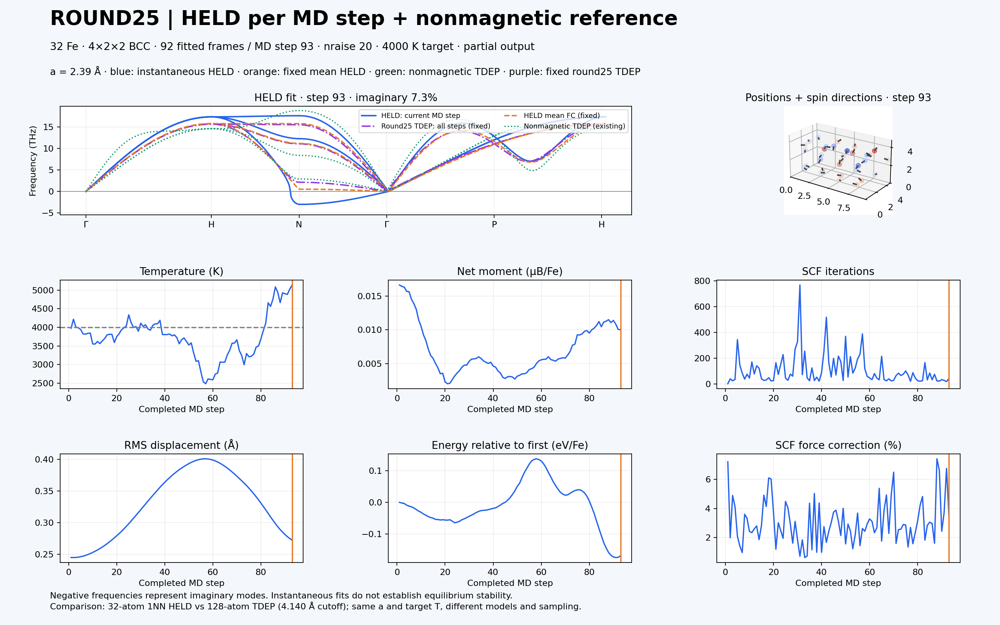
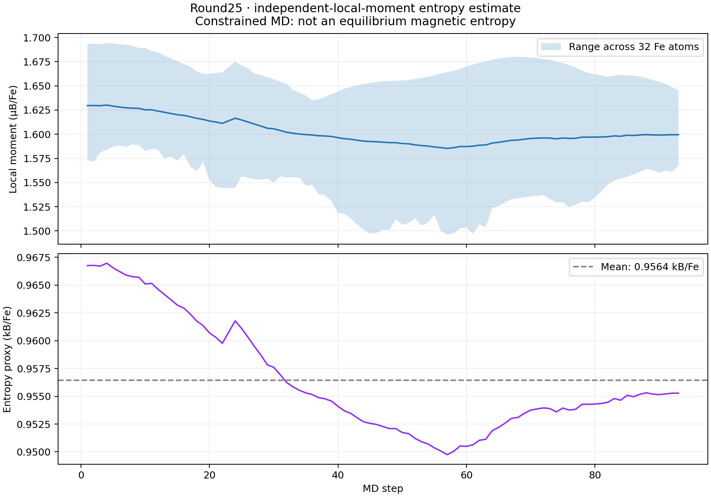

# Round25: restart phonons and magnetic entropy estimate

Updated 2026-09-21. BCC Fe, 32 atoms (4×2×2), a = 2.39 Å, target
4000 K, constrained noncollinear magnetization, no SOC, nraise = 20.

## Trajectory selection

Selected `md_400steps.run000.out` and `md_400steps.run002.out` contain
93 completed MD records. Analysis uses **92 configurations: steps 1–22 and
24–93**. Step 23 is omitted because the restart header does not verify its
force-evaluation geometry. Later forces are paired with the preceding printed
propagated positions. The older overlapping `run001` is excluded.
Unconverged or unfinished trailing SCF evaluations are excluded. This is a
partial trajectory, not a completed 400-step run. Source hashes are recorded
in [summary.json](summary.json).

## Phonons

The ensemble TDEP fit (cutoff 2.3422 Å, first neighbors only) has no imaginary
frequencies along the calculated symmetry path. The fixed mean HELD
force-constant dispersion also has no imaginary modes on this path.
Individual HELD fits have imaginary modes at steps 1–22, 24–31 and 80–93;
the minimum across all fitted frames is −4.9513 THz.

The animation shows instantaneous HELD (blue), fixed mean HELD force constants
(orange), fixed ensemble TDEP (purple), and the existing nonmagnetic TDEP
reference (green). No latter-half curve is included.

The nonmagnetic reference has the same lattice parameter and target temperature,
but uses 128 atoms and a reported 4.140 Å cutoff. Differences cannot be assigned
solely to magnetism. Short sampling and a first-neighbor model do not establish
converged equilibrium stability.



[Animated dashboard: 92 frames](round25_dashboard.gif) ·
[Per-frame HELD results](round25_held_steps.csv) · [HELD summary](held_summary.json)

## Spin entropy: model estimate

Using local moment magnitudes from the same 92 configurations, calculate

`S_proxy / (N kB) = mean_frames mean_atoms ln(1 + |m_i| / μB)`.

This assumes independent local moments in the high-temperature disordered
limit, g approximately 2, and neglects orbital contributions. It is a
local-moment degeneracy approximation, not an entropy measured from the
probabilities of sampled spin configurations.

| Quantity | Result |
| --- | ---: |
| Mean local moment | 1.60259 μB/Fe |
| Mean entropy estimate | 0.95643 kB/Fe |
| Molar entropy estimate | 7.95223 J/(mol Fe K) |
| −T S estimate at assumed 4000 K | −0.32968 eV/Fe |
| Standard deviation across frames | 0.00504 kB/Fe |

The frame standard deviation is not an error bar on the mean: MD frames are
correlated. Atomic magnetic constraints prevent interpreting this trajectory as
unrestricted equilibrium spin sampling. Local moments depend on the projection
scheme; magnetic correlations and model uncertainty are not included.
**This estimate has not been added to Helmholtz free energies.**

Method background: [Khmelevskyi, arXiv:1709.03868](https://arxiv.org/abs/1709.03868).



[Per-step entropy CSV](spin_entropy_steps.csv) ·
[Entropy summary and source hashes](spin_entropy_summary.json)

## Local regeneration

The analysis scripts and TDEP working folders currently live outside this
repository, in `../dataset/bcc/magnetic-noncollinear/round25/` relative to the
repository root. On the original workstation, from the repository root:

```bash
bash ../dataset/bcc/magnetic-noncollinear/round25/update_phonons.sh
python3 ../dataset/bcc/magnetic-noncollinear/round25/update_spin_entropy.py
```

These commands require the existing local TDEP/HELD installation and selected
raw MD outputs; a fresh repository clone alone cannot run them. The files in
this documentation directory are a published results snapshot, not an
automatically refreshed copy. TDEP work directories and raw outputs are not
included in this report.
